# TrabajoFinalGit
# carlos perez pacheco, añado un lorem ipsun y cambio el background, utilizando para operar code, para poder abrir visual studio, luego git checkout -b y el nombre de mi branch para crearla con los datos del main los commit para "guardar" cambios y el push para subirla al repositorio

#Mario Gómez Sánchez
Creo el repositorio, creo la rama mario, hice la galeria en html y estilos de css y use en la terminal bash los siguientes comandos: 
git init
git checkout -b 
git add .
git commit -m 
git push origin 
git pull origin main
git merge main

# William Fernando Herrera Aima

## Calculadora básica

He creado es una calculadora muy básica creada para realizar operaciones aritméticas simples. A continuación se describen los pasos para crear y utilizar esta calculadora.
Con su apariencia y lógica correspondiente

## Comandos usados
- Git clone 
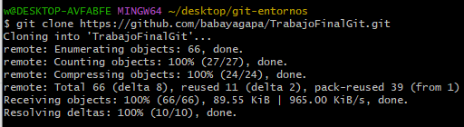
- Git init
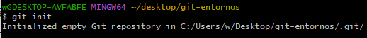
- Git add .
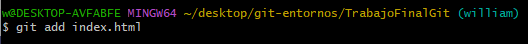
- Git commit -m
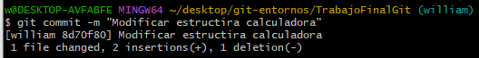
- Git log
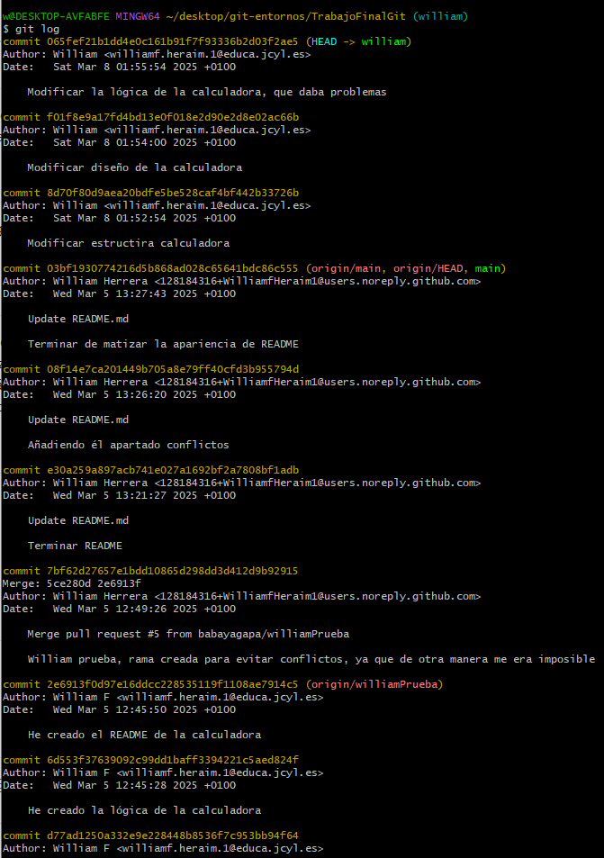
- Git branch
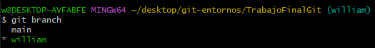
- Git chekout (-b)
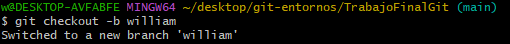
- Git push
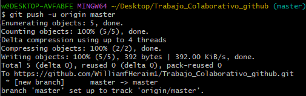
- Git merge

- Git pull origin

- Git status
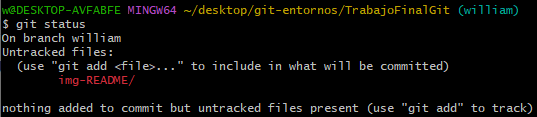
- Git remote
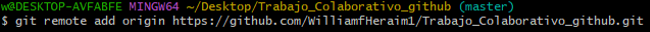

## Conflictos

He tenido varios conflictos, y estuve probando cambiando el código, ir actualizando y probando desde git y no había manera, después de uans horas vi que la mejor solución era crear otra rama y realizarlo ahí ya que el problema, yo creo que radicaba en había conflicto entre mi compañero y yo, y la solución más rápida y limpia era crear otra rama que, al realizarlo y subirlo con sus correspondientes comandos, no dió ningún problema, no como al principio.

## Características

- Suma
- Resta
- Multiplicación
- División

## Requisitos

- [Lenguaje de programación utilizado] (JavaScript)
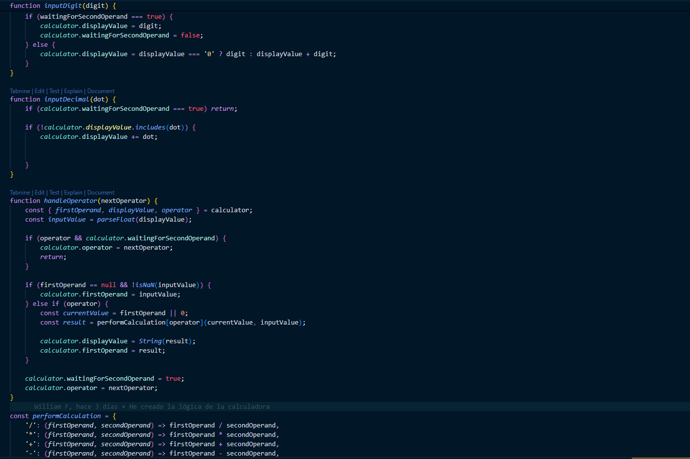

- [Entorno de desarrollo] (Visual Studio Code)
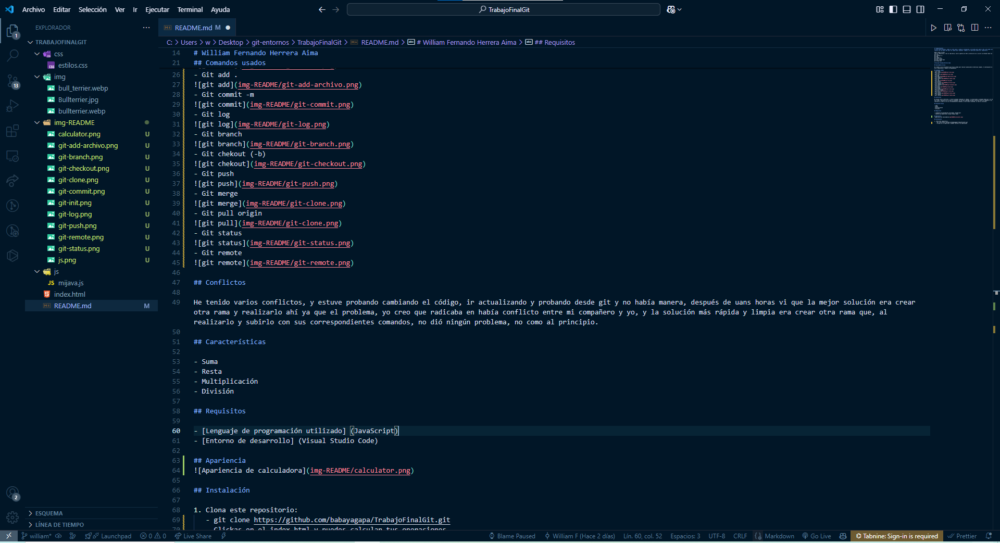

## Apariencia
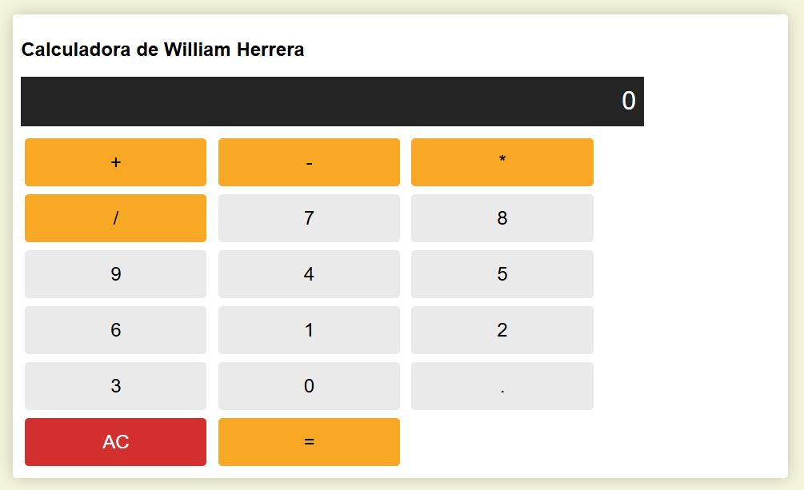

## Instalación

1. Clona este repositorio:
   - Para clonar el repositorio visita [GitHub](https://github.com/babayagapa/TrabajoFinalGit)
   - git clone https://github.com/babayagapa/TrabajoFinalGit.git
   - Clickas en el index.html y puedes calcular tus operaciones

   
